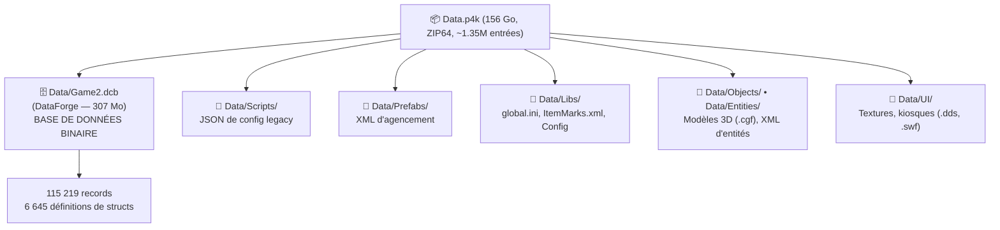
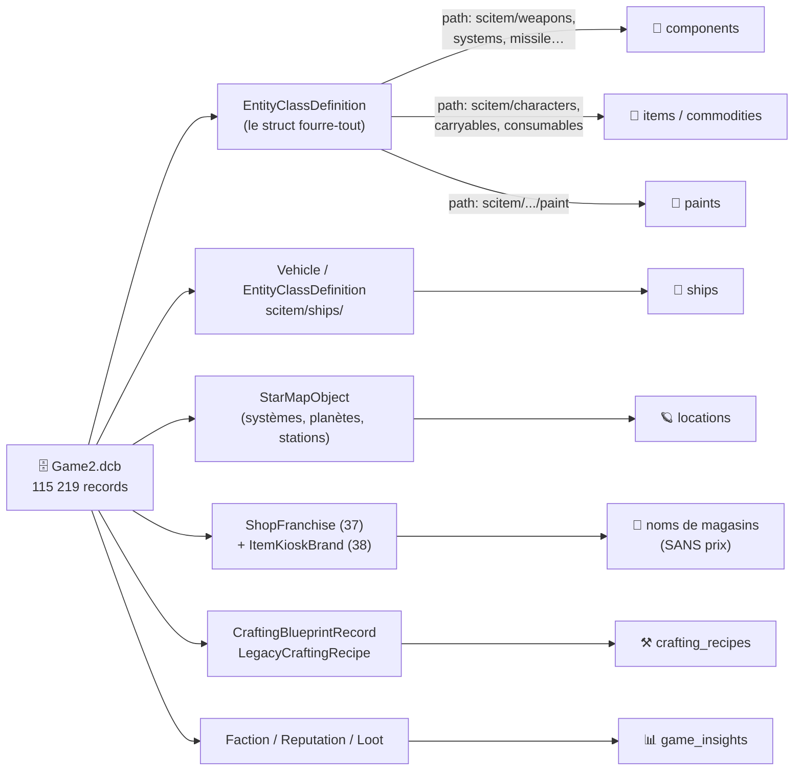
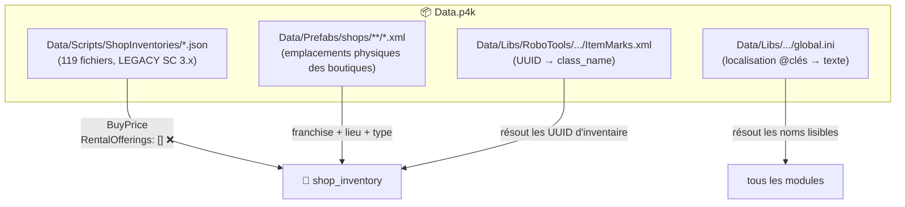
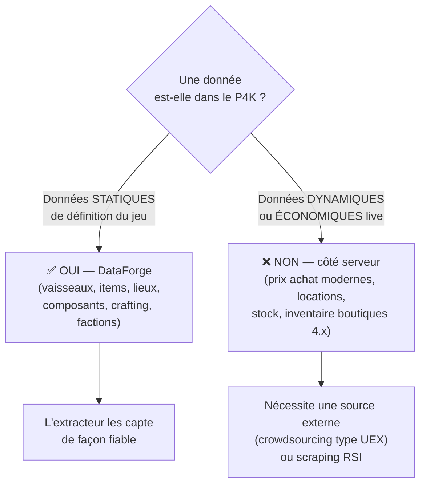

# Organisation des fichiers Star Citizen & couverture d'extraction

> Schéma de référence : comment les fichiers du jeu Star Citizen sont organisés,
> croisé avec ce que l'extracteur Starvis parse réellement. Sert à savoir, donnée
> par donnée, ce qui est **vraiment** extractible du `Data.p4k` et ce qui ne l'est pas.
>
> Référence build : P4K LIVE 4.8.2 (~156 Go, 1 350 155 entrées, `Game2.dcb` 307 Mo,
> 115 219 records / 6 645 structs). Audité le 2026-06-18.

## 1. Structure physique du `Data.p4k`

Le jeu tient dans **un seul fichier** `Data.p4k`, une archive **ZIP64** géante
avec compression Zstandard + chiffrement AES sur certaines entrées.

Accès dans le code : `extractor/src/dataforge/p4k-provider.ts` (lecture ZIP64 +
Zstd), `extractor/src/dataforge/dataforge-parser.ts` (parsing du `.dcb`),
`extractor/src/dataforge/dataforge-service.ts` (orchestration).

## 2. Le cœur : `Game2.dcb` (DataForge)

C'est **la base de données du jeu**. Chaque « record » est typé par un « struct »
et porte un `fileName` virtuel (ex. `libs/foundry/records/entities/scitem/...`)
utilisé pour la classification. C'est de là que vient l'immense majorité des données.

**Mécanisme commun à tous les extracteurs P4K** : trouver un struct par son nom
(`structDefs.findIndex`), filtrer les records par **motif de chemin** (`fileName`),
puis lire les valeurs via `readInstance`. La classification est **basée sur les
chemins**, pas sur des champs explicites.

## 3. Sources secondaires (hors DataForge)

## 4. Tableau de vérité : qu'est-ce qui est VRAIMENT extractible du P4K ?

| Donnée | Source réelle | Dans le P4K ? | Statut |
|---|---|---|---|
| 🚀 Vaisseaux + stats + ports | DataForge `Vehicle` / `EntityClassDefinition` | ✅ Oui | **Fiable** |
| 🔧 Composants (armes, boucliers, QD…) | DataForge `EntityClassDefinition` (path scitem) | ✅ Oui | **Fiable** |
| 🎒 Items FPS, armures, consommables | DataForge `EntityClassDefinition` | ✅ Oui | **Fiable** |
| 📦 Commodités (matériaux, gaz…) | DataForge | ✅ Oui | **Fiable** |
| 🎨 Peintures / liveries | DataForge (path `paint`) | ✅ Oui | **Fiable** |
| ⚒️ Recettes de crafting | DataForge `CraftingBlueprintRecord` | ✅ Oui | **Fiable** |
| 🪐 Systèmes / planètes / stations | DataForge `StarMapObject` | ✅ Oui | **Fiable** |
| 📊 Factions / réputation / loot | DataForge | ✅ Oui | **Fiable** |
| ⛏️ Minage (gisements, lasers) | DataForge | ✅ Oui | **Fiable** |
| 🏪 **Noms** des magasins | DataForge `ShopFranchise` + Prefabs | ✅ Oui | **Partiel** |
| 💰 **Prix d'achat** des vaisseaux | `ShopInventories/*.json` (legacy) | ⚠️ Partiel | **6 magasins Stanton hist. seulement** |
| 💰 **Prix de location** | `ShopInventories/*.json` → `RentalOfferings:[]` | ❌ Vide | **Pas dans le P4K** |
| 🏪 Magasins **modernes** (Pyro, Orison, decks) | — | ❌ Assets 3D uniquement | **Pas dans le P4K** |
| 💵 Prix pledge (USD) | — | ❌ Non | **Site RSI uniquement** |

## 5. Règle générale : statique vs dynamique

Le P4K contient tout ce qui **définit** le jeu (le « catalogue » : quels vaisseaux,
items, stats et lieux existent), mais **pas** ce qui relève de **l'économie vivante**
(prix réels du moment, stock, locations, boutiques pilotées serveur depuis la 3.18+).

## 6. Implications connues

- **~90 % des tables** (`ships`, `components`, `items`, `commodities`, `paints`,
  `locations`, `crafting_recipes`, mining, factions, reputation) proviennent
  légitimement et fidèlement du DataForge.
- **Boutiques / prix** = seul point faible structurel : la source `ShopInventories`
  est un **vestige SC 3.x** qui ne couvre que 6 concessionnaires historiques de
  Stanton et **aucun prix de location** (`RentalOfferings` toujours `[]`).
- Les magasins réels manquants (Crusader Showroom/Orison, Buy & Fly/Pyro,
  Traveler Rentals/Orison, Refinery & Cargo Decks) n'existent dans le P4K que sous
  forme **d'assets 3D** (`.cgf`, `.dds`, signalétique) — sans données d'inventaire.
- Pour couvrir l'économie complète (prix achat modernes + locations + magasins 4.x),
  il faut une **brique d'ingestion externe** (API crowdsourcée type UEX Corp), ce
  qui sort du périmètre de l'extraction P4K.

## 7. Ré-vérification approfondie (2026-06-18)

Un second audit exhaustif a confirmé qu'**aucune donnée de boutique/prix/location
n'est cachée** ailleurs dans le P4K :

| Piste vérifiée | Résultat |
|---|---|
| Balayage de **toutes** les propriétés DataForge (`price/cost/rent/msrp/credit/buy/sell/lease`) | 661 noms de propriétés « prix », mais seuls des **singletons globaux** portent des valeurs (`GlobalShopCommodityParams`, `GlobalShopTerminalParams`, `GlobalShopBuying/SellingParams` — 1 record chacun) : paramètres d'économie globaux, **aucun prix par boutique/par vaisseau** |
| Re-scan **complet** des 119 fichiers `ShopInventories` | 6 749 entrées, 6 107 avec `BuyPrice>0`, **0 `RentalOfferings` non vide, 0 donnée de location** |
| Balayage des noms de fichiers P4K (économie/prix/store) | Aucun fichier de données d'inventaire hors `ShopInventories` ; les `Data/Prefabs/shops/**` sont des **scènes CryXML binaires** (agencement 3D), sans prix |
| Records nommés d'après les dealers modernes (Showroom, Buy & Fly, Astro Armada, Regal…) | 514 occurrences = dialogues, styles UI, marques, fabricants, franchises — **0 inventaire, 0 prix** |

Conclusion : les inventaires et prix des boutiques SC 4.x sont **autoritaires côté
serveur** et ne sont tout simplement pas livrés dans le client. La liste en jeu de
l'utilisateur est exacte ; seule une source externe peut la compléter.

> Notes d'audit détaillées (méthode, fichiers exacts trouvés) conservées en mémoire
> repo : `shop-rental-extraction.md`.
